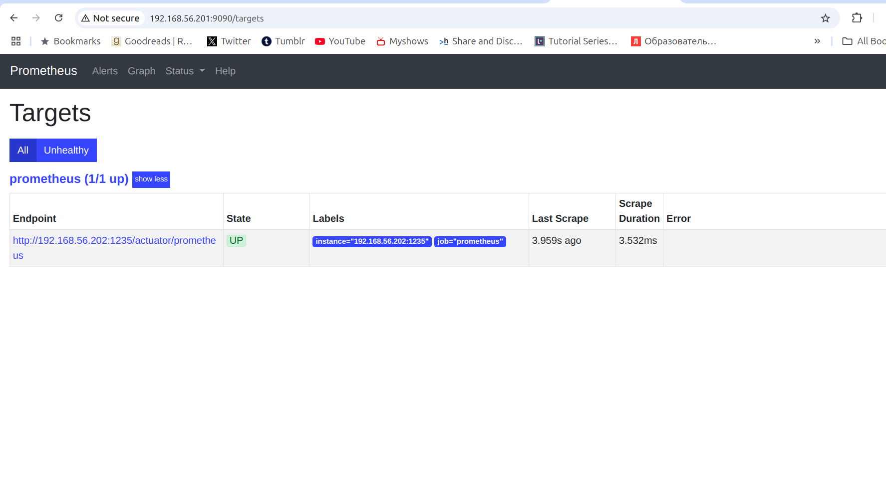
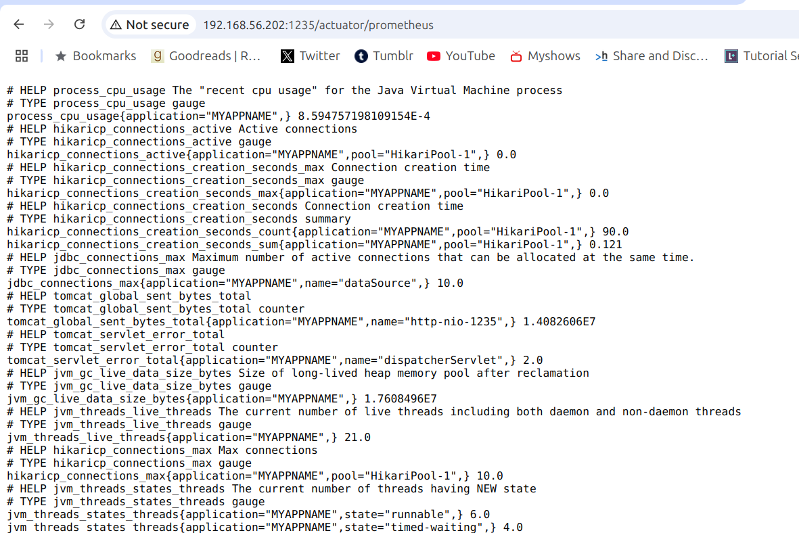

## Лабораторная работа №6

### Роли в гитлабе
[Grafana-роль](https://gitlab.com/yeklalex-k/ansible-roles/ansible-role-grafana)
[Prometheus-роль](https://gitlab.com/yeklalex-k/ansible-roles/ansible-role-prometheus)
[Loki-роль](https://gitlab.com/yeklalex-k/ansible-roles/ansible-role-loki)

### Установка

Из корневой директории репозитория:

Поднять vm
```
vagrant up
```
Установить роли

```
ansible-galaxy install -r lab6/requirements.yml
```

Запустить плейбук

```
ansible-playbook lab6/playbook.yml -i lab6/inventories 
```


Поднимаются два сервера, monitoring srv1 и app srv2. В group_vars указаны переменные, необходимые для каждого сервера.

Графана доступна по

`http://192.168.56.201:3000/`


Prometheus доступен по

`http://192.168.56.201:9090/`



API Loki доступен по

`http://192.168.56.201:3100/`

Приложение доступно по

`http://192.168.56.202:1235`


